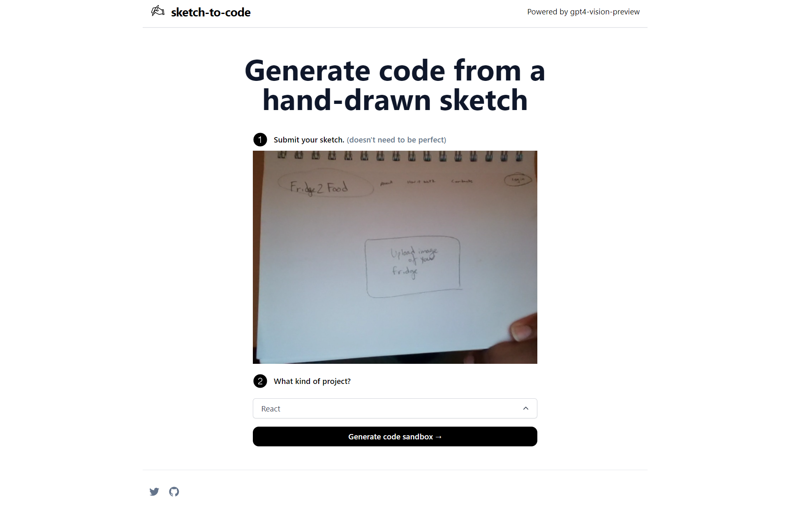

# [sketch2code.app](https://www.sketch2code.app/)

This project generates React + Tailwindcss web app code based on a quick sketch on paper for you using AI, specifically gpt4-vision-preview.

[](https://www.twitterbio.io)

## How it works

This project uses the [ChatGPT API](https://openai.com/api/) and the [Vercel AI SDK](https://sdk.vercel.ai/docs) with streaming. It constructs a prompt based on the form and user input, sends it to the ChatGPT API with a Vercel Edge Function, then streams the response back to the application UI.

> This template has recently been updated for the AI SDK, simplifying the amount of code needed. I previously published a [video](https://youtu.be/JcE-1xzQTE0) and [blog post](https://vercel.com/blog/gpt-3-app-next-js-vercel-edge-functions) showing the older approach.

## Running Locally

After cloning the repo, go to [OpenAI](https://beta.openai.com/account/api-keys) to make an account and put your API key in a file called `.env`.

Then, run the application in the command line and it will be available at `http://localhost:3000`.

```bash
pnpm run dev
```

## One-Click Deploy

Deploy the example using [Vercel](https://vercel.com?utm_source=github&utm_medium=readme&utm_campaign=vercel-examples):

[](https://vercel.com/new/clone?repository-url=https://github.com/cameronking4/sketch2code&env=OPENAI_API_KEY&project-name=sketch-2-code-hack&repo-name=sketch2code)
